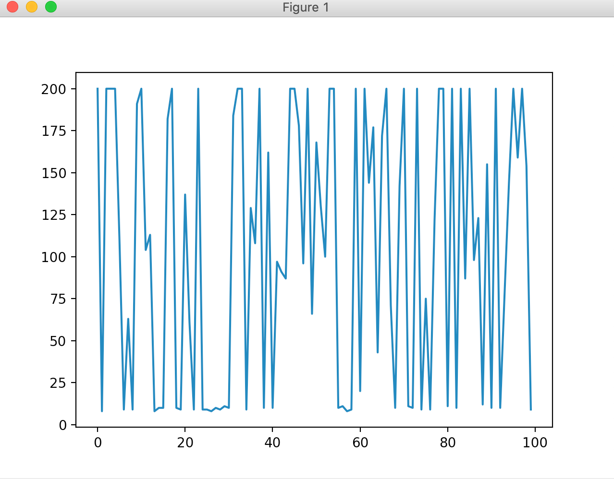
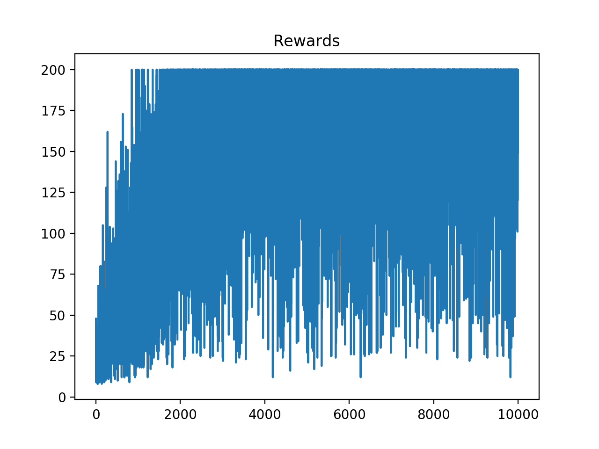
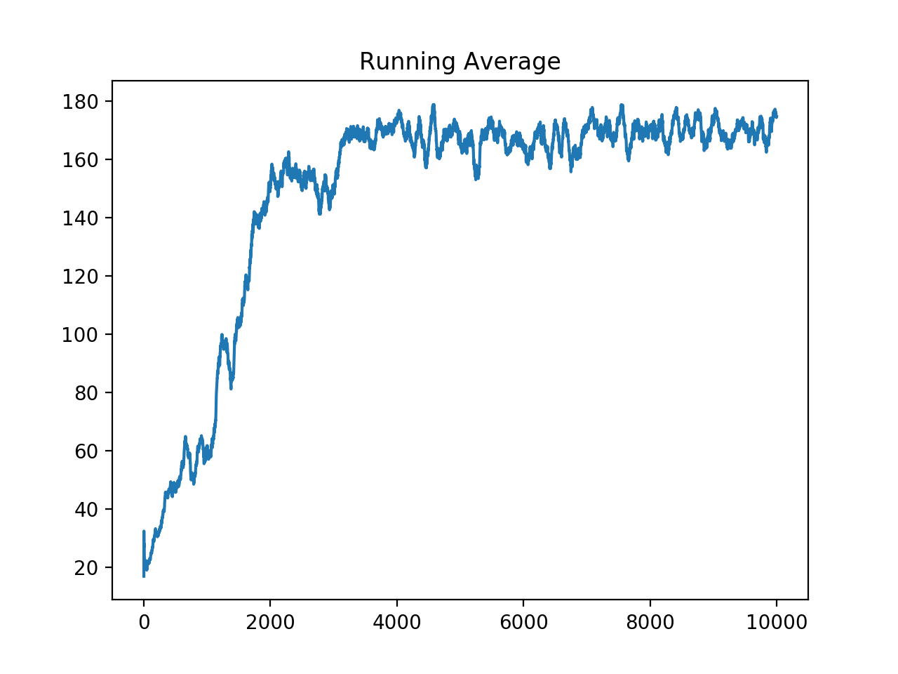
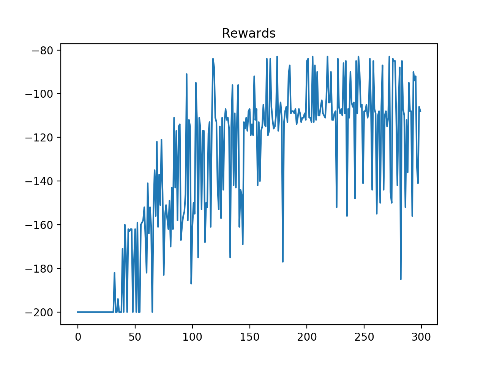
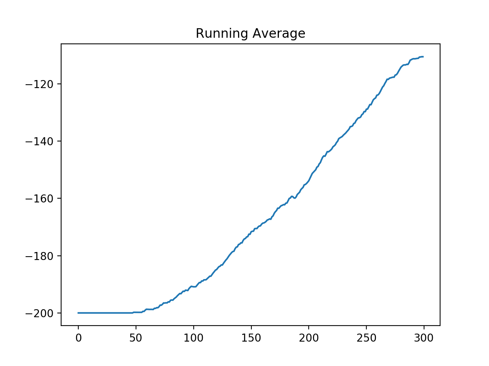
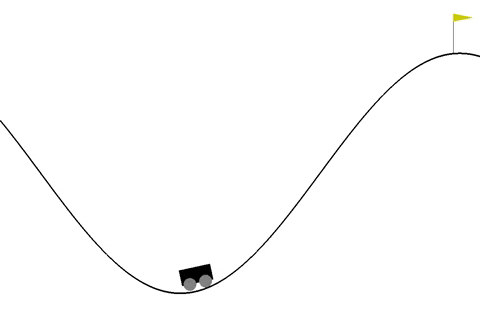

## Intro to OpenAI Gym and Basic Reinforcement Learning Techniques

###  Intro

 file has an introductory routine where cartpole environment is setup from gym and random actions are performed until episode isn't over. We calculate the average number of steps before the episode ends.

### Random Search

 file is used to solve the cartpole problem using a random search method. A random parameters array is defined and its performance is measured on the simulation. The best parameter array is chosen to be the solution. We basically search for the best hyperparameter in R^n, where n is the dimension of the parameters.

The below graph shows the number of time-steps for each parameter.

  

### Cartpole with bins

Since a lot of the states never actually occur (when pole goes beyond an angle, very high velocities etc.) we can reduce the number of plausible states to a smaller (finite) number.

- We define bins for each parameter in the observation space and the state is determined by the combination of the bins.
- As the agent plays, q-table is updated for the state action pair it comes across using the q-learning equation

 file solves the cartpole problem using bins method.
Below are the total rewards and the running average while training the agent.

  

  

### Radial Basis Function Neural Network

Here we will use an RBF Neural Network to approximate the Q value and take the action accordingly.

- RBF network is used here to project the non-linear low dimensional input data (the state of the environment) into a high dimension so that it becomes linearly separable (Cover's Theorem).

- A Stochastic Gradient Regressor is maintained for each action in the action-space of environment to predict the Q-value for the action-state pair and is trained using the data we get while playing each episode (online learning).

- SGDRegressor is trained using partial_fit method for incremental learning.

 file implements the above approach. Here are the associated graphs:

Rewards recorded over the course of training. As the agent learns to play the game, rewards become less negative.

  

Below the is the running average which improves as agents learns by playing.

  

**Here is how agent performs after learning:**

